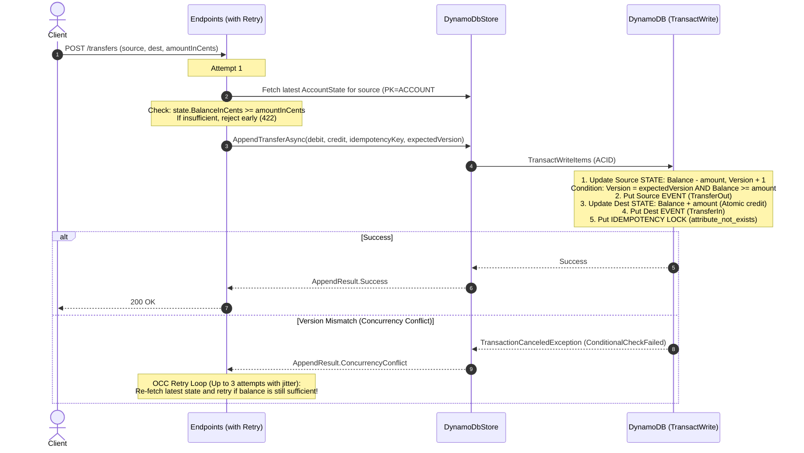

# Next Steps Architectural Plan: Cents Pivot & Optimistic Balance Locking

## 1. Executive Summary

This plan outlines two key architectural improvements for **LedgerMock**:
1. **Pivot to Minor Currency Units (`long` / Cents):** Align with fintech standards (Stripe, Nubank, ISO 4217) to eliminate floating-point and serialization hazards across systems.
2. **Account Balance Snapshot & Optimistic Concurrency Control (OCC):** Introduce a balance snapshot co-located in the same DynamoDB table using single-table design patterns, enabling atomic balance checks, overdraft protection, and optimistic locking before committing transactions.

---

## 2. Single-Table DynamoDB Schema Design

By co-locating the account snapshot and historical events under the **same Partition Key (`PK`)**, DynamoDB provides item collection locality and lets us execute conditional checks and event appends in a single transactional write.

### Key Structure:

| Entity Type | Partition Key (`PK`) | Sort Key (`SK`) | Attributes & Usage |
| :--- | :--- | :--- | :--- |
| **Account State (Snapshot)** | `ACCOUNT#{accountId}` | `STATE` | `BalanceInCents` (N), `Version` (N), `UpdatedAt` (S) |
| **Ledger Event** | `ACCOUNT#{accountId}` | `EVENT#{timestamp}#{eventId}` | `AmountInCents` (N), `Type` (S), `EventId` (S) |
| **Idempotency Lock** | `IDEMPOTENCY#{key}` | `LOCK` | `CreatedAt` (S) |

```mermaid
erDiagram
    ACCOUNT_PARTITION {
        string PK "ACCOUNT#acc-001"
        string SK_State "STATE (Snapshot & Version)"
        string SK_Event "EVENT#2026-10-07... (Append-only facts)"
    }
    IDEMPOTENCY_PARTITION {
        string PK "IDEMPOTENCY#tx-123"
        string SK "LOCK"
    }
```

---

## 3. How Optimistic Locking & Balance Checking Will Work

### Asymmetry: Debit vs. Credit Leg
- **Debits (Withdrawals & Transfer Origin):** Require balance validation and strict serialization to prevent overdrafting.
  - **Optimistic Lock:** Checked against `expectedVersion` and `BalanceInCents >= amountInCents`.
  - **Atomic Commit:** Increments `Version = Version + 1` and decrements `BalanceInCents` atomically in `SK=STATE`.
- **Credits (Deposits & Transfer Destination):** Cannot cause an overdraft.
  - Can use atomic increment (`ADD BalanceInCents :amount` or unversioned increment) on `SK=STATE` to eliminate lock contention on high-inflow accounts (e.g. merchants receiving many simultaneous payments).



### Withdrawal Optimistic Lock
For `POST /accounts/{id}/withdraw`:
1. Read `SK=STATE` $\to$ get `currentBalance` and `currentVersion`.
2. Check `currentBalance >= amountInCents`.
3. In `TransactWriteItems`:
   - Append `EVENT#...` (Withdrawal)
   - Update `STATE`: `SET BalanceInCents = BalanceInCents - :amount, Version = Version + 1` with condition `Version = :expectedVersion AND BalanceInCents >= :amount`.
   - Lock `IDEMPOTENCY#{key}`.
4. If version conflict occurs $\to$ retry up to 3 times with jitter.

### Key Advantages:
1. **Zero Overdrafts Guaranteed at DB Level:**
   `ConditionExpression: "Version = :expectedVersion AND BalanceInCents >= :amount"` ensures that even under concurrent race conditions, an account balance can never drop below zero.
2. **Fast $O(1)$ Balance Lookups:**
   `GET /accounts/{id}/balance` reads `SK=STATE` in 1ms instead of replaying thousands of historical events, while the immutable event log remains intact for audit reconciliation.
3. **No Lock Contention on Payees:**
   By applying OCC only to the origin/spending account and using atomic updates on the recipient, high-volume merchants do not trigger retry storms.
4. **Transparent UX via OCC + Retry:**
   In the rare event of a race on the source account, a brief 10ms retry re-checks and completes without exposing an error to the user.

---

## 4. Phase-by-Phase Execution Plan

### Phase 1: Pivot to Cents / Minor Units (`long`)
*Execute step-by-step, validating tests after each step:*
- [x] **Step 1.1: Domain Models:** Update `AccountState` (`BalanceInCents`), `Transaction` (`AmountInCents`), and `TransferCompleted` (`AmountInCents`) to use `long`.
- [x] **Step 1.2: Domain Logic & Unit Tests:** Update `LedgerLogic.cs` to calculate balances in cents, update `LedgerLogicTests.cs` to test integer arithmetic with boundary values, and verify tests pass.
- [x] **Step 1.3: Infrastructure / DynamoDbStore:** Update `DynamoDbStore` attribute mapping from `decimal` to `long` (`AmountInCents` stored as numeric `N`).
- [x] **Step 1.4: Logger Extensions:** Update `WorkerLoggerExtensions` method signatures and formats to accept `long amountInCents`.
- [x] **Step 1.5: Endpoints & DTOs:** Update `DepositRequest`, `WithdrawRequest`, `TransferRequest` payloads to use `long AmountInCents`, and update endpoint validations (`AmountInCents <= 0`).
- [x] **Step 1.6: Endpoint Tests:** Update `EndpointTests.cs` to test cents payloads and verify all 16 tests pass cleanly.
- [x] **Step 1.7: Documentation & Samples:** Update `README.md` and `LedgerMock.http` with cents examples.

### Phase 2: Schema Expansion in `DynamoDbStore`
1. The existing table schema (`PK` string, `SK` string) already supports `SK=STATE` without any DDL changes.
2. Implement `GetAccountStateAsync(string accountId)` to fetch `SK=STATE` with fallback to `0` balance for new accounts.
3. Update `AppendTransactionAsync` to execute:
   - Event `Put`
   - State `Update` (conditional on version & sufficient balance for withdrawals)
   - Idempotency `Put`
4. Update `AppendTransferAsync` to execute atomic double-entry with version updates on both accounts.

### Phase 3: Domain Result & Concurrency Handling
1. Update `AppendResult` enum:
   ```csharp
   public enum AppendResult
   {
       Success,
       Duplicate,
       InsufficientFunds,
       ConcurrencyConflict
   }
   ```
2. Map endpoints in `Endpoints.cs` to return appropriate HTTP status codes:
   - `422 Unprocessable Entity` for `InsufficientFunds`
   - `409 Conflict` for `ConcurrencyConflict`
   - `200 OK` for `Duplicate` and `Success`

### Phase 4: Unit & Concurrency Testing
1. Add unit tests for `InsufficientFunds` and `ConcurrencyConflict` scenarios.
2. Verify that all test suites and GitHub Actions CI pass.
3. Update `README.md` and `LedgerMock.http` with cents-based request payloads.
